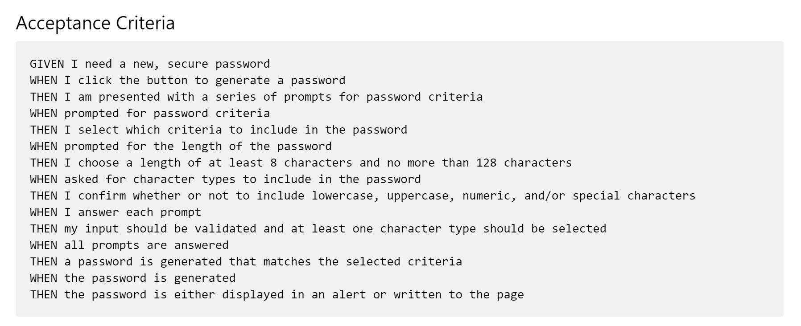
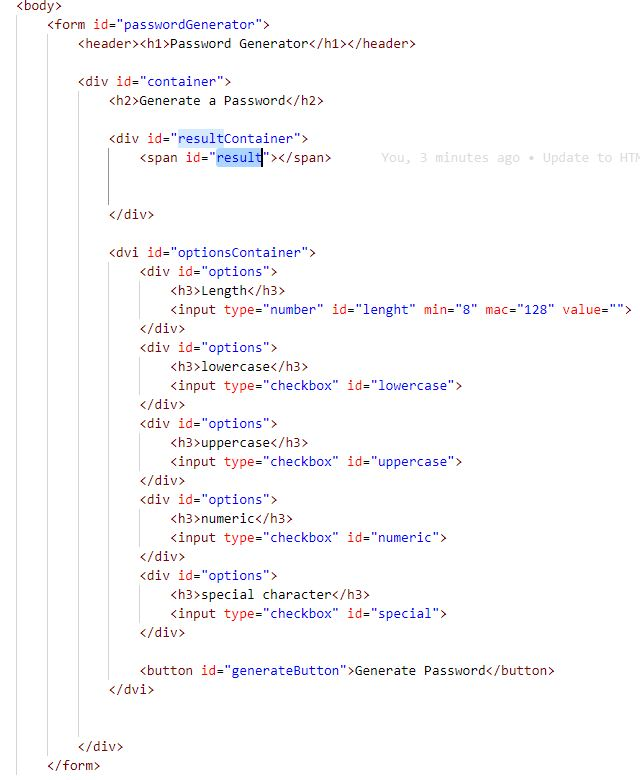
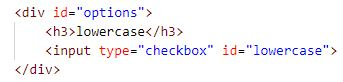
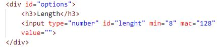
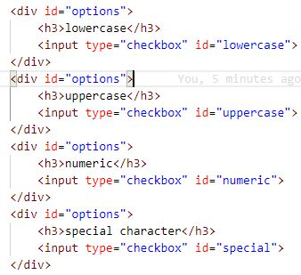

# Homework-Three
Password Generator

This assignment had the follow criteria. This ReadMe will detail how each of these criteria was met with code. 

Criteria One: "WHEN I click the button to generate a password, THEN I am presented with a series of prompts for password criteria" 

Criteria Two: "WHEN prompted for password criteria, THEN I select which criteria to include in the password"

Criteria Three: "WHEN prompted for the length of the password, THEN I choose a length of at least 8 characters and no more than 128 characters"

Criteria Four: "WHEN asked for character types to include in the password, THEN I confirm whether or not to include lowercase, uppercase, numeric, and/or special characters"

Criteria Five: "WHEN I answer each prompt, THEN my input should be validated and at least one character type should be selected"

Criteria Six: "WHEN all prompts are answered, THEN a password is generated that matches the selected criteria"

Criteria Seven: "WHEN the password is generated, THEN the password is either displayed in an alert or written to the page"
